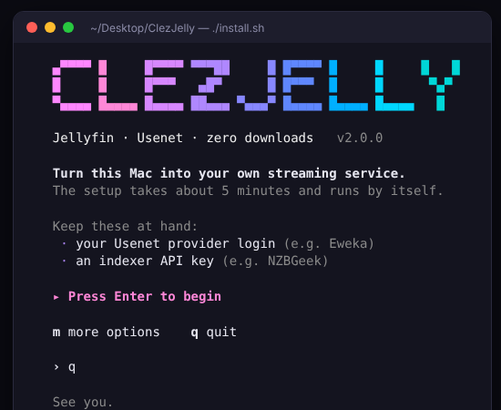
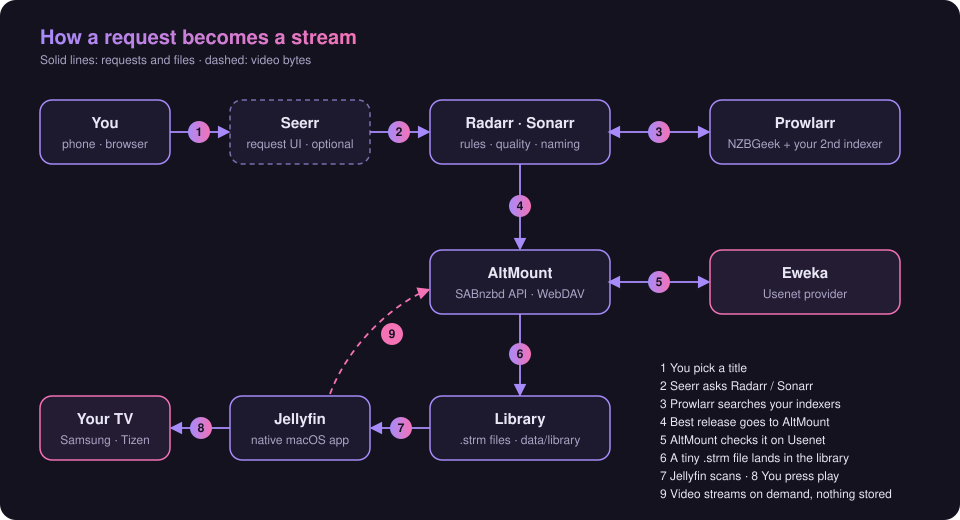
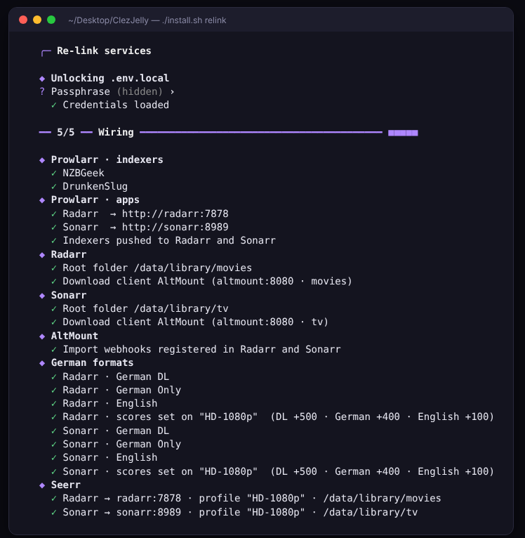
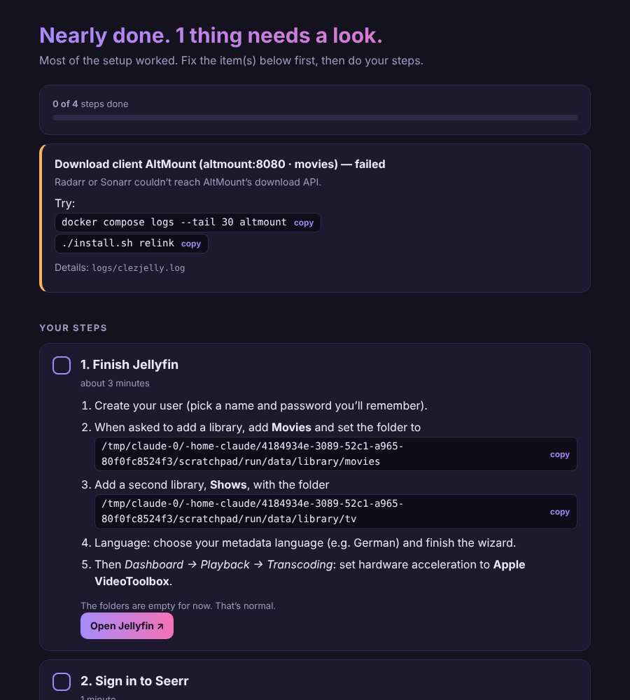
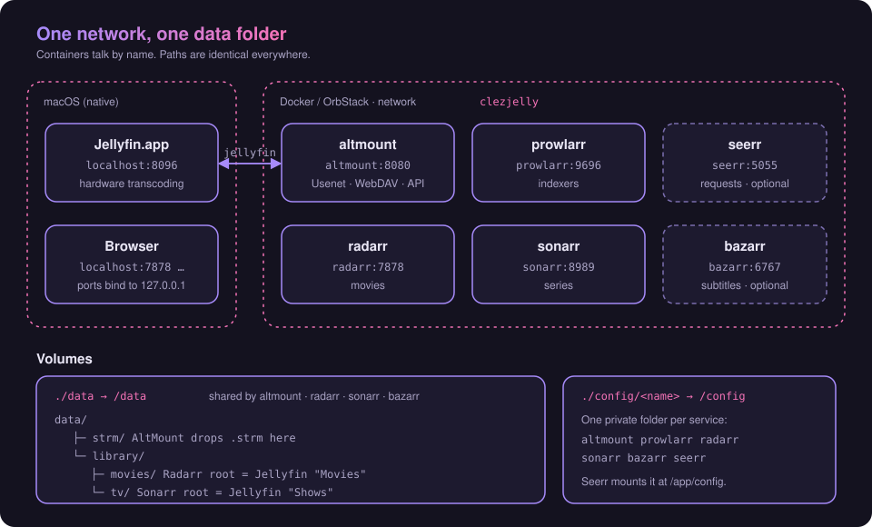

<h1 align="center">ClezJelly</h1>

<p align="center">
  <b>Dein eigener Streamingdienst auf dem Mac.</b><br>
  Jellyfin + Usenet + automatische Bibliothek. Nichts wird heruntergeladen. Alles wird gestreamt.
</p>

<p align="center">
  <a href="README.md">English</a> ·
  <a href="docs/01-prerequisites.md">Voraussetzungen</a> ·
  <a href="docs/02-installation.md">Installation</a> ·
  <a href="docs/03-configuration.md">Konfiguration</a> ·
  <a href="docs/06-troubleshooting.md">Fehlersuche</a>
</p>

<p align="center">
  
  
  
  
</p>

> Die Detail-Guides in `docs/` sind auf Englisch. Dieses README gibt dir die komplette Übersicht auf Deutsch.

---

## Was ist das?

ClezJelly macht aus einem übrigen Mac einen privaten Streamingdienst. Du wünschst dir einen Film oder eine Serie, und wenige Sekunden später ist sie in Jellyfin und läuft auf deinem Fernseher. Deine Festplatte füllt sich dabei nicht, denn die Bibliothek besteht aus winzigen `.strm`-Verweisdateien. Das Video wird erst beim Abspielen direkt aus dem Usenet gestreamt.

Ein Installer richtet **sechs Dienste** ein, verbindet sie untereinander und trägt alle API-Keys, Ordner und Qualitätsregeln ein. Du beantwortest ein paar Fragen, mehr nicht.

<p align="center">
  
</p>

### Was du bekommst

| Dienst | Aufgabe | Adresse |
|---|---|---|
| **Jellyfin** | Medienserver und Apps für den Fernseher (native macOS-App) | `localhost:8096` |
| **AltMount** | Liest das Usenet, schreibt `.strm`-Dateien, verhält sich wie ein Download-Client | `localhost:8080` |
| **Radarr** | Findet und sortiert Filme | `localhost:7878` |
| **Sonarr** | Findet und sortiert Serien | `localhost:8989` |
| **Prowlarr** | Verwaltet deine Indexer einmalig und teilt sie mit Radarr und Sonarr | `localhost:9696` |
| **Seerr** *(optional)* | „Netflix-artige“ Wunschseite für dich und deinen Haushalt | `localhost:5055` |
| **Bazarr** *(optional)* | Untertitel | `localhost:6767` |

---

## So funktioniert es

<p align="center">
  
</p>

1. Du wählst einen Titel in **Seerr** (oder direkt in Radarr / Sonarr).
2. **Radarr** bzw. **Sonarr** lässt **Prowlarr** deine Indexer durchsuchen.
3. Der beste Release nach deinen Qualitätsregeln geht an **AltMount**, als wäre es ein Download-Client.
4. AltMount prüft die Dateien im **Usenet** (über deinen Provider), lädt sie aber nicht herunter.
5. Es legt eine winzige `.strm`-Datei in der Bibliothek ab. Radarr / Sonarr benennen sie um und importieren sie.
6. **Jellyfin** sieht den neuen Titel. Du drückst Play, und das Video wird bei Bedarf aus dem Usenet gestreamt.

Auf deiner Platte liegen nur `.strm`-Dateien und Konfiguration. Eine ganze Staffel sind ein paar Kilobyte.

---

## Schnellstart

Du brauchst einen Mac mit Homebrew, eine Container-Laufzeit (OrbStack oder Docker Desktop), einen Usenet-Provider und einen Indexer. Der [Voraussetzungen-Guide](docs/01-prerequisites.md) führt durch alles.

```bash
bash <(curl -fsSL https://raw.githubusercontent.com/clezcoding/ClezJelly/main/scripts/quickstart.sh)
```

Das klont das Projekt nach **`~/Desktop/ClezJelly`** und startet den Installer. Lieber erst ansehen?

```bash
git clone https://github.com/clezcoding/ClezJelly.git ~/Desktop/ClezJelly
cd ~/Desktop/ClezJelly
./install.sh
```

Der Installer ist ein Menü. Wähle **1 · Install**, dann laufen fünf Phasen:

| Phase | Was passiert |
|---|---|
| **1 · Preflight** | Prüft macOS, Homebrew, Docker/OrbStack, Jellyfin, freie Ports |
| **2 · Setup** | Du wählst die Komponenten (Seerr, Bazarr, deutsche Formate, LAN-Zugriff) und gibst Provider- und Indexer-Logins ein, verschlüsselt gespeichert |
| **3 · Folders & configs** | Legt `data/` und `config/` an und schreibt für jeden Dienst eine frische Konfiguration |
| **4 · Containers** | Startet alles und wartet, bis es gesund ist |
| **5 · Wiring** | Verbindet alle Dienste über ihre APIs miteinander |

<p align="center">
  
</p>

Am Ende öffnet sich eine **Anleitungsseite im Browser**: eine Checkliste mit den wenigen Dingen, die nur du tun kannst (Jellyfin-Benutzer anlegen, zwei Bibliotheken hinzufügen, Fernseher verbinden), mit Kopieren-Buttons, Live-Status der Dienste und Lösungen, falls ein Schritt Aufmerksamkeit braucht. Öffne sie jederzeit neu mit `./install.sh guide`.

<p align="center">
  
</p>

---

## Ein Netzwerk, ein Datenordner

Alle Container hängen in einem privaten Netzwerk namens `clezjelly`. Sie erreichen sich über einfache Namen, du musst dir keine IP-Adressen merken: `http://radarr:7878`, `http://altmount:8080`, `http://prowlarr:9696`.

Jellyfin läuft nativ auf macOS (Hardware-Transcoding), die Container erreichen es trotzdem unter dem Namen `jellyfin`.

<p align="center">
  
</p>

Alle Container, die mit Medien arbeiten, sehen **denselben Ordner unter demselben Pfad**. Deshalb kommen Radarr, Sonarr, AltMount und Bazarr nie durcheinander, wo eine Datei liegt.

```
data/
├─ strm/            hier legt AltMount die .strm-Dateien ab
└─ library/
   ├─ movies/       Radarr-Stammordner  →  Jellyfin „Filme“
   └─ tv/           Sonarr-Stammordner  →  Jellyfin „Serien“
config/<dienst>/    ein eigener Konfigurationsordner pro Dienst
```

---

## Alltag

```bash
./install.sh            # das Menü
./install.sh guide      # Checkliste erneut öffnen
./install.sh status     # Zustand aller Dienste
./install.sh up         # starten (öffnet auch Jellyfin)
./install.sh down       # stoppen
./install.sh update     # neue Images laden, geänderte Container neu erstellen
./install.sh backup     # nur Secrets oder kompletter Snapshot
```

<details>
<summary><b>Alle Befehle</b></summary>

| Befehl | Macht |
|---|---|
| `install` | Geführte Ersteinrichtung |
| `components` | Seerr, Bazarr, deutsche Formate, LAN-Zugriff ein- oder ausschalten |
| `credentials` | Provider- oder Indexer-Logins ändern |
| `relink` | Verbindungen zwischen den Diensten reparieren (gefahrlos wiederholbar) |
| `german` | Deutsche Qualitätsformate (erneut) anwenden |
| `rebuild` | Konfigurationen aus den Vorlagen neu anlegen (deine Dateien werden vorher gesichert) |
| `guide` | Die „Was jetzt?“-Checkliste im Browser öffnen |
| `status` | Alle Dienste prüfen |
| `up` / `down` / `update` | Den Stack steuern |
| `backup` / `restore` | Secrets oder Snapshot, abgelegt in `~/ClezJelly-backups` |
| `help` | Diese Liste |

Die Skripte in `scripts/` (`start-stack.sh`, `stop-stack.sh`, `update-stack.sh`, `health-check.sh`) sind schlanke Hüllen um dieselben Befehle.

</details>

---

## Komponenten wählen

Das Menü hat einen **Components**-Bildschirm. Außer den vier Kerndiensten ist alles optional.

| Komponente | Standard | Hinweis |
|---|---|---|
| Seerr | an | Wunschseite für den Haushalt |
| Bazarr | an | Untertitel |
| Deutsche Formate | an | Bewertet deutsche Releases höher ([Details](docs/04-german-content.md)) |
| Seerr im LAN | an | Erreichbar für Handys und Tablets zu Hause |
| AltMount im LAN | **aus** | Nur nötig, wenn ein Jellyfin-Client `.strm`-Links nicht abspielt, siehe [Fehlersuche](docs/06-troubleshooting.md) |
| Jellyfin am Ende öffnen | an | Startet die App nach der Installation |

Deine Auswahl steht in `.clezjelly.conf` und lässt sich jederzeit ändern. Wenn du etwas abschaltest, wird der Container entfernt, die Konfiguration bleibt.

---

## Sicherheit

ClezJelly ist so gebaut, dass du das Repo auf GitHub legen kannst, ohne etwas zu verraten.

- **Secrets sind verschlüsselt.** Provider- und Indexer-Logins liegen in `.env.local`, verschlüsselt mit AES-256 (PBKDF2, 200.000 Iterationen) und deiner Passphrase. Nichts liegt im Klartext.
- **Nichts Persönliches wird committet.** `.env`, `.env.local`, `.clezjelly.conf`, `config/` und `data/` stehen alle in der `.gitignore`.
- **Standardmäßig lokal.** Ports binden an `127.0.0.1`. Nur Seerr wird für dein Heimnetz geöffnet, und nur wenn du die Option aktiv lässt.
- **Frische Schlüssel pro Installation.** Alle API-Keys und das AltMount-Login-Secret werden zufällig auf deinem Mac erzeugt.
- **Private Dateien.** Erzeugte Dateien haben `chmod 600`, der Backup-Ordner `700`.
- **Keine Cloud, kein Tracking.** Der Installer spricht nur mit deinen eigenen Diensten sowie Homebrew und den Docker-Registries.

> Setze diese Ports nicht dem Internet aus. Für Streaming von unterwegs nimm [Tailscale](docs/05-samsung-tv.md#remote-access-with-tailscale).

Sichere `.env.local` **und** merke dir deine Passphrase. Ohne sie ist die Datei nicht wiederherzustellen.

---

## Ehrliche Hinweise

- ClezJelly steuert die echten APIs von Radarr, Sonarr, Prowlarr und AltMount. Diese Projekte ändern sich. Schlägt nach einem Update ein Verbindungsschritt fehl, ist **Re-link** gefahrlos wiederholbar, und `logs/clezjelly.log` sagt dir, was schiefging.
- Die Vorkonfiguration von Seerr und Bazarr schreibt deren Konfigurationsdateien direkt. Beides ist „best effort“. Falls einer die Einstellungen nicht übernimmt, führt dich seine Weboberfläche in einer Minute durch dieselben Schritte.
- Das Standard-AltMount-Image ist der Apple-Silicon-Build. Auf Intel setzt du `ALTMOUNT_IMAGE=ghcr.io/javi11/altmount:latest` in der `.env`.
- Du bist selbst dafür verantwortlich, was du streamst und dass du das geltende Recht einhältst. Nutze das Projekt nur mit Inhalten, auf die du Zugriff haben darfst.

---

## Projektstruktur

```
ClezJelly/
├─ install.sh                 Menü und CLI
├─ docker-compose.yml         die sechs Dienste, ein Netzwerk
├─ config-templates/          Start-Konfigurationen (AltMount, Prowlarr, Radarr, Sonarr, Bazarr)
├─ scripts/
│  ├─ quickstart.sh           Ein-Zeilen-Installation
│  ├─ bootstrap/              die fünf Installer-Phasen, je eine Datei
│  └─ lib/                    UI, Eingaben, Verschlüsselung, API-Helfer
└─ docs/                      Guides und Diagramme
```

## Guides (Englisch)

| | |
|---|---|
| [01 · Prerequisites](docs/01-prerequisites.md) | Accounts und Software vorab |
| [02 · Installation](docs/02-installation.md) | Der Installer Schritt für Schritt |
| [03 · Configuration](docs/03-configuration.md) | Was eingerichtet wurde und wie du es anpasst |
| [04 · German content](docs/04-german-content.md) | Deutsche Releases und Metadaten |
| [05 · Samsung TV](docs/05-samsung-tv.md) | Tizen-App, Bitrate, Fernzugriff |
| [06 · Troubleshooting](docs/06-troubleshooting.md) | Wenn etwas nicht klappt |

## Danksagung

Gebaut auf der Arbeit von [Jellyfin](https://jellyfin.org/), [AltMount](https://github.com/javi11/altmount), [Radarr](https://radarr.video/), [Sonarr](https://sonarr.tv/), [Prowlarr](https://prowlarr.com/), [Seerr](https://github.com/seerr-team/seerr), [Bazarr](https://www.bazarr.media/) und den [TRaSH Guides](https://trash-guides.info/).

## Lizenz

[MIT](LICENSE)
